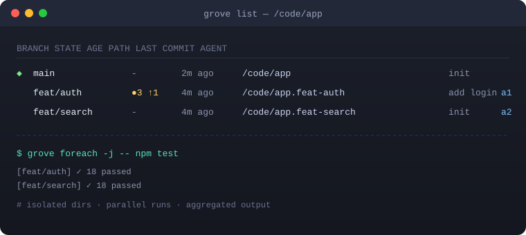

<div align="center">

# 🌳 Grove

**让 Git Worktree 像分支一样简单 —— 为「多个 AI Agent 并行干活」而生的零依赖编排引擎**

[](LICENSE)
[](https://www.python.org/)
[](https://github.com/gitstq/grove/actions)
[](CONTRIBUTING.md)
[](requirements.txt)

**🌐 语言 / Language：** [简体中文](README.md) ｜ [繁體中文](README.zh-TW.md) ｜ [English](README.en.md)

</div>

---

## 🎉 项目介绍

**Grove（小树林）** 是一个用纯 Python 标准库实现的 **Git Worktree 编排引擎**。当你同时让 Claude Code、Codex、Cursor 等多个 AI 编程代理并行处理 5～10 个任务时，Git 原生的 [worktree](https://git-scm.com/docs/git-worktree) 能为每个任务提供互不干扰的工作目录，但它的命令行体验非常繁琐——光是新建一个工作树，就要把分支名敲三遍：

```bash
git worktree add -b feature/login ../repo.feature/login   # 第 1、2 遍
cd ../repo.feature/login                                  # 第 3 遍
```

Grove 把这一切压缩成一行，并且**只需要记住分支名**，路径由模板自动计算：

```bash
grove add feature/login     # 建工作树 + 建分支，一步到位
grove list                  # 查看所有工作树的实时状态
grove foreach -j -- npm test# 在每个工作树里并行跑测试
grove remove feature/login  # 安全清理（带未提交改动保护）
```

> 💡 **解决的痛点**：多 Agent 并行时目录互相踩踏、worktree 路径要手算、批量操作缺失、构建缓存重复安装、并行开发服务端口冲突、清理容易误删未提交代码。

### 🌟 自研差异化亮点

- 🪶 **真正零三方运行时依赖**：只用 Python 标准库 + 系统自带 `git`，`pip install` 秒装，无需 Rust/Node 工具链，离线可用。
- 🤖 **Agent / CI 优先**：所有命令都支持 `--json` 结构化输出与稳定退出码，可直接被自动化脚本、流水线和 AI Agent 调用。
- ⚡ **并行编排原语**：`grove exec` / `grove foreach --parallel` 一键在多个工作树中并行执行命令，输出按工作树聚合，并注入 `GROVE_BRANCH` 等环境变量。
- 🧩 **跨平台构建缓存共享**：`grove share` 用硬链接 / 复制 / 软链接 / 自适应降级策略，让多个工作树共享 `node_modules`、`target`、`.venv`，告别冷启动（Windows / macOS / Linux 通用）。
- 🔢 **确定性端口分配**：`grove port` 基于 FNV-1a 哈希为每个工作树分配稳定且互不冲突的本地开发端口。
- 🛡️ **安全护栏**：未提交改动保护、`--dry-run` 预演、删除确认、路径穿越拦截，默认不做任何危险操作。
- 🧭 **灵感来源**：产品理念参考了本周 GitHub Trending 上热门的 worktree 管理工具 worktrunk（Rust 实现）所验证的真实需求，但 Grove **未使用其任何一行代码**，采用纯 Python 从零自研，并在并行编排、跨平台缓存、JSON 自动化等方向做了差异化增强。

---

## ✨ 核心特性

| 能力 | 命令 | 说明 |
| --- | --- | --- |
| 🌱 一步建工作树 | `grove add <分支>` | 自动建分支 + 工作树，分支名只敲一次，支持 `--base/--agent/--detach` |
| 🔀 秒切 PR 到工作树 | `grove add pr:123` | 直接把某个 Pull Request 拉到独立工作树与分支 |
| 📋 实时状态总览 | `grove list` | 脏文件数、未跟踪数、相对上游 ahead/behind、最近提交、Agent 标签 |
| 🔎 定位与跳转 | `grove where / info / cd` | 按分支名或路径解析工作树，输出可被脚本消费 |
| 🧹 安全清理 | `grove remove / prune` | 脏目录保护、可选删分支、`--force`、`--dry-run` |
| 🚀 单树执行 | `grove exec <名> -- <命令>` | 在指定工作树内执行任意命令并继承其环境 |
| 🏃 批量并行 | `grove foreach [-j] -- <命令>` | 顺序或并行在所有工作树执行，输出带标签聚合 |
| 📦 缓存共享 | `grove share <名> <路径…>` | 多策略复用主工作树的依赖/构建缓存，自动降级 |
- 🔢 **确定性端口**：`grove port <名>` 输出稳定端口，方便「每个工作树一个 dev server」。
- ⚙️ **模板化路径 + 两级配置**：`{parent}/{repo}.{slug}` 等变量自由组合，支持全局 + 仓库级 JSON 配置与 `GROVE_*` 环境变量覆盖。
- 🩺 **自检**：`grove doctor` 一键检查 git 版本、配置合法性、工作树元数据完整性。
- 🖥️ **跨平台**：Windows / macOS / Linux 一致体验，提供 `--ascii` 纯字符模式兼容老式终端。
- 🧪 **高可测**：34 个单元测试基于真实临时 Git 仓库，覆盖完整生命周期。

---

## 🚀 快速开始

### 环境要求

- 🐍 Python **3.8 及以上**（无需任何第三方运行时依赖）
- 🐙 系统已安装 **Git ≥ 2.20** 并在 `PATH` 中（`git --version` 可查看）

### 安装

```bash
# 方式一：pip / pipx 安装（推荐，安装后得到全局命令 grove）
pip install grove-wt
grove --version

# 方式二：免安装，克隆后直接用源码启动器运行
git clone https://github.com/gitstq/grove.git
cd grove
python run_grove.py --version
```

> Windows 用户也可以使用 `py -m grove`；如果你的终端里 `grove` 与其它程序重名，可改用 `python -m grove`。

### 30 秒上手

```bash
# 进入任意一个 Git 仓库
cd your-repo

# 1) 为两个并行任务各建一个工作树
grove add feature/auth    --agent agent-1
grove add feature/search  --agent agent-2

# 2) 查看所有工作树状态（主工作树以 ◆ 标记）
grove list

# 3) 进入某个工作树（配合下方 shell 集成可直接 cd）
cd "$(grove where feature/auth)"

# 4) 在所有工作树并行跑测试
grove foreach --parallel -- npm test

# 5) 任务完成后安全清理（有未提交改动会被拦下）
grove remove feature/auth
```

### 让 `grove` 直接切换目录（可选 Shell 集成）

子进程无法修改父 Shell 的当前目录，因此 `grove cd` 只打印路径。把下面函数加入 `~/.bashrc` / `~/.zshrc` 即可用 `gcd` 一键跳转（fish / PowerShell 版本见
[examples/shell-integration.md](examples/shell-integration.md)）：

```bash
gcd() { local t; t="$(grove where "$1" 2>/dev/null)" || { grove add "$1" || return 1; t="$(grove where "$1")"; }; cd "$t" || return 1; }
```

---

## 📖 详细使用指南

### 命令总览

```text
grove add <name> [-b BASE] [-a AGENT] [-p PATH] [--detach]
grove list|ls [--json] [--porcelain] [--ascii]
grove info <name> [--json]
grove where <name>          # 打印工作树绝对路径
grove cd <name>             # where 的语义化别名
grove remove|rm <name> [-f] [--keep-branch] [-y] [-n]
grove prune [-n]
grove exec <name> -- <cmd...>
grove foreach|each [-j] [--include-main] -- <cmd...>
grove share <name> <relpath...> [-s hardlink|copy|symlink|reflink] [-f] [-n]
grove port <name>
grove doctor [--json]
grove config [--json]
```

### 全局参数（放在子命令前后均可）

| 参数 | 作用 |
| --- | --- |
| `-C, --repo DIR` | 假定在 DIR 中启动（类似 `git -C`） |
| `--config FILE` | 指定额外的 JSON 配置文件 |
| `--json` | 机器可读的 JSON 输出（自动化首选） |
| `--ascii` | 纯 ASCII 符号，兼容不支持 Unicode 的终端 |
| `-n, --dry-run` | 只打印执行计划，不做任何改动 |
| `-y, --yes` | 破坏性操作免确认（CI 场景） |

### 1）创建工作树 `grove add`

```bash
grove add feature/login                 # 从默认基线创建新分支 + 工作树
grove add hotfix -b release/v2          # 以指定 ref 为基线
grove add experiment --detach           # 游离 HEAD，不建分支
grove add pr/123 || grove add pr:123   # 检出第 123 号 PR
grove add feat/x -p ../custom/path      # 自定义落地路径
grove add feat/x -n                     # 预演：只看路径与计划，不创建
```

默认路径模板是 `{parent}/{repo}.{slug}`：主仓库在 `/code/app`，分支 `feat/x` 的工作树就落在 `/code/app.feat-x`。`slug` 会把 `feat/x` 安全地转换成跨平台目录名 `feat-x`。

### 2）状态总览 `grove list`

```bash
grove list            # 人类可读表格
grove list --json     # 结构化，交给 jq / Agent / CI
grove list --porcelain# 原生 git worktree list --porcelain 透传
```

输出字段：主工作树标记 `◆`、分支名、状态（`●n` 表示 n 处改动、`↑n/↓n` 表示相对上游领先/落后）、最近提交时间、路径、提交标题与 Agent 标签。

### 3）批量并行 `grove foreach` 与单树 `grove exec`

```bash
# 在每个非主工作树中并行拉取依赖
grove foreach -j -- npm ci

# 连主工作树一起跑
grove foreach --include-main -- pytest -q

# 只在某一个工作树执行
grove exec feature/auth -- npm run build
```

执行时会注入环境变量：`GROVE_BRANCH`（当前分支）、`GROVE_WORKTREE`（工作树路径）、`GROVE_REPO_ROOT`（主仓库路径）。任一工作树失败，整体退出码非 0，便于流水线判定。

### 4）共享构建缓存 `grove share`

```bash
# 主工作树已经 npm install，把 node_modules 硬链接共享给新工作树，秒级完成
grove share feature/auth node_modules
grove share feature/x target .venv -s hardlink
grove share feature/x node_modules -s symlink     # 改为软链接
grove share feature/x node_modules -n             # 预演
```

策略说明：`hardlink`（默认，同卷下 inode 级共享、最省空间，遇到不支持的文件自动回退复制）、`copy`（完全独立副本）、`symlink`（实时共享目录）、`reflink`（尽力 CoW，失败自动降级）。所有路径必须是仓库内相对路径，`../` 穿越会被拒绝。

### 5）确定性端口 `grove port`

```bash
grove port feature/auth   # -> 例如 44483；同一分支永远得到同一端口
```

在启动开发服务器时使用，即可让每个工作树拥有稳定、互不冲突的端口：

```bash
grove exec feature/auth -- sh -c 'PORT=$(grove port feature/auth) npm run dev'
```

### 6）清理 `grove remove` / `grove prune`

```bash
grove remove feature/auth          # 有未提交改动会拒绝
grove remove feature/auth -f       # 强制丢弃并删除对应分支
grove remove feature/auth --keep-branch  # 只删工作树，保留分支
grove prune                        # 清理失效的管理记录与元数据
grove remove feature/auth -n       # 预演，不删除
```

### ⚙️ 配置体系

查找优先级（后者覆盖前者）：内置默认值 → 全局 `~/.config/grove/config.json`（Windows 为 `%APPDATA%\grove\config.json`）→ 仓库根目录 `.groveconfig.json` → `--config` → `GROVE_*` 环境变量。

```json
{
  "path_template": "{parent}/{repo}.{slug}",
  "port_base": 40000,
  "port_span": 20000,
  "cache_strategy": "hardlink",
  "default_base": "main",
  "auto_prune": true,
  "include_main_in_foreach": false
}
```

可用模板变量：`{parent}`（主仓库父目录）、`{repo}`（主仓库目录名）、`{slug}`（安全化后的分支名）、`{branch}`（原始分支名）、`{agent}`（Agent 标签）、`{name}`。完整示例见
[examples/groveconfig.example.json](examples/groveconfig.example.json)。

### 🧭 典型场景：让 N 个 AI Agent 并行开发

```bash
for name in feat/auth feat/billing feat/search; do
  grove add "$name" --agent "$name"
  ( cd "$(grove where "$name")" && your-ai-cli "实现 $name，完成后自测" & )
done

grove list --json | jq -r '.[] | select(.is_main|not) | "\(.branch)\t\(.changed)\t\(.path)"'
grove share feat/auth node_modules          # 复用依赖
grove foreach -j -- npm test                # 并行回归
grove foreach -- git status --short         # 汇总改动
```

### 🖼️ 运行演示

下图为 `grove list` 的终端效果示意（完整演示动图将更新于 `docs/demo.gif`）：

<div align="center"></div>

### ❓ 常见问题

- **Q：和直接用 `git worktree` 有什么区别？** A：Grove 只按分支名寻址、路径自动计算，并补齐了批量执行、缓存共享、端口分配、状态总览和安全护栏；底层仍调用原生 git，不改动仓库结构。
- **Q：会污染我的仓库吗？** A：仅在 Git 公共目录写入一个 `grove-meta.json` 记录 Agent 标签等元数据，不会出现在工作树 `git status` 中；删除该文件即可完全移除。
- **Q：需要联网吗？** A：除 `pr:N` 拉取 PR 外，所有功能离线可用。
- **Q：支持哪些系统？** A：Windows / macOS / Linux，Python 3.8+，Git 2.20+。

---

## 💡 设计思路与迭代计划

### 设计理念

1. **零依赖即可靠性**：在 AI Agent 与 CI 的极简环境里，任何第三方依赖都是故障源。Grove 仅依赖标准库与系统 git，因此可以在任意机器上即装即用。
2. **组合优于内置**：Grove 不重复实现 Git，而是把原生 `worktree` 能力封装成可组合、可脚本化的原语，通过 `--json` 与稳定退出码融入自动化。
3. **默认安全**：一切破坏性动作都有脏目录保护、预演与确认；显式 `--force/--yes` 才能越界。
4. **为并行而生**：多 Agent 的核心诉求是「批量、并行、隔离、可观测」，`foreach/exec/share/port/list` 正是围绕这四点设计。

### 为什么选 Python 标准库

跨平台一致性最好、AI/数据生态最普及、标准库的 `subprocess/argparse/concurrent.futures/pathlib` 已足够覆盖全部需求，使用者无需编译工具链即可审计和运行每一行代码。

### 🗺️ 迭代路线图

- [ ] v1.1：交互式工作树选择器（方向键浏览 + diff/log 预览）
- [ ] v1.1：`grove merge` 一体化合并工作流（squash/rebase/清理）
- [ ] v1.2：生命周期钩子（create/pre-merge/post-merge）
- [ ] v1.2：与 Claude Code / Codex / Cursor 的会话模板联动
- [ ] v1.3：远程工作树状态聚合（CI 状态、PR 摘要）
- [ ] v1.3：shell 自动补全（bash/zsh/fish/PowerShell）

欢迎在 [Issues](https://github.com/gitstq/grove/issues) 提出需求；贡献方向见 [CONTRIBUTING.md](CONTRIBUTING.md)。

---

## 📦 打包与部署指南

Grove 属于 **CLI 工具 / 工具库**，以 Python Wheel 形式分发，无需下载可执行文件。

### 从源码构建

```bash
make build            # 等价于：编译检查 + 测试 + 生成 wheel/sdist 到 dist/
# 或不依赖 make：
bash scripts/build.sh         # Linux / macOS
powershell scripts/build.ps1  # Windows
```

构建产物：

```text
dist/grove_wt-1.0.0-py3-none-any.whl   # 通用纯 Python wheel
dist/grove-wt-1.0.0.tar.gz             # 源码分发包
```

### 本地安装与验证

```bash
pip install dist/grove_wt-1.0.0-py3-none-any.whl
grove --version && grove doctor
```

### 作为库集成

```python
from grove import WorktreeManager, Config

mgr = WorktreeManager(cwd="/path/to/repo", config=Config(cache_strategy="hardlink"))
wt = mgr.add("feature/x", agent="agent-1")
for w in mgr.list():
    print(w.label, w.path, w.dirty)
report = mgr.foreach(["pytest", "-q"], parallel=True)
print(report.ok)
```

兼容环境：Python 3.8 / 3.9 / 3.10 / 3.11 / 3.12 / 3.13；Windows、macOS、Linux；CI 矩阵已在 GitHub Actions（ubuntu / macos / windows）覆盖。

---

## 🤝 贡献指南

我们欢迎 Issue、PR 与文档翻译！开始前请阅读 [CONTRIBUTING.md](CONTRIBUTING.md)：

- 提交信息遵循 **Angular 规范**：`feat:` / `fix:` / `docs:` / `refactor:` / `test:` / `chore:` / `ci:`。
- 请保持「零三方运行时依赖」，新命令需同时提供 `--json` 与单元测试。
- 提交前运行 `python -m unittest discover -s tests` 确保全绿。
- Issue 请附上 `grove --version`、`git --version`、操作系统、复现命令与期望/实际结果。

---

## 📄 开源协议

本项目基于 **[MIT License](LICENSE)** 开源，可自由用于个人与商业用途，保留版权声明即可。

<div align="center">

🌳 **Grove —— 让每一个并行任务都拥有自己的一片小树林。**

如果对你有帮助，欢迎点一个 ⭐ 支持！

</div>
